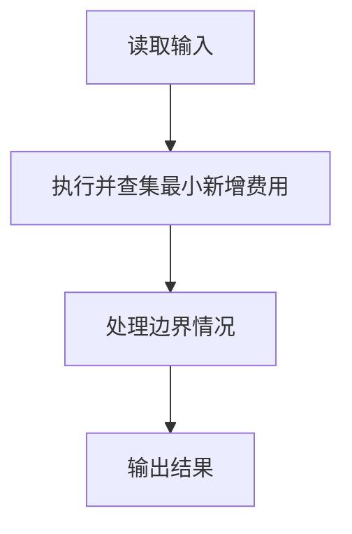
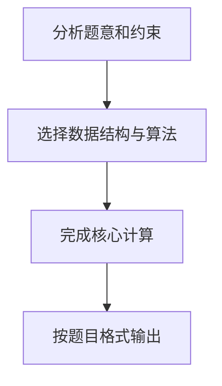

## 7-50 畅通工程之局部最小花费问题

- **分值：** 35分

## 题目描述

某地区经过对城镇交通状况的调查，得到现有城镇间快速道路的统计数据，并提出“畅通工程”的目标：使整个地区任何两个城镇间都可以实现快速交通（但不一定有直接的快速道路相连，只要互相间接通过快速路可达即可）。现得到城镇道路统计表，表中列出了任意两城镇间修建快速路的费用，以及该道路是否已经修通的状态。现请你编写程序，计算出全地区畅通需要的最低成本。

## 输入格式

输入的第一行给出村庄数目N (1≤ N ≤ 100)；随后的N(N-1)/2行对应村庄间道路的成本及修建状态：每行给出4个正整数，分别是两个村庄的编号（从1编号到N），此两村庄间道路的成本，以及修建状态 — 1表示已建，0表示未建。

## 输出格式

输出全省畅通需要的最低成本。

## 输入样例
```text
4
1 2 1 1
1 3 4 0
1 4 1 1
2 3 3 0
2 4 2 1
3 4 5 0
```

## 输出样例
```text
3
```

## 解题思路

本题采用并查集最小新增费用，围绕题目给出的数据结构和约束完成核心计算，并处理边界情况。

## 代码流程说明

1. 读取题目规定的输入数据。
2. 使用并查集最小新增费用完成主要处理。
3. 处理边界情况并整理结果。
4. 按指定格式输出结果。

## 代码实现


```perl
# 先合并已建道路，再按费用升序执行 Kruskal，只支付连接不同集合的边。
use strict;
use warnings;

my $input  = do { local $/; <STDIN> // '' };
my @values = grep { length } split /\s+/, $input;
exit unless @values;
my $n      = shift @values;
my @parent = 0 .. $n;
my @rank   = (0) x ( $n + 1 );

sub find {
    my ($x) = @_;
    $parent[$x] = find( $parent[$x] ) if $parent[$x] != $x;
    return $parent[$x];
}

sub union {
    my ( $a, $b ) = ( find( $_[0] ), find( $_[1] ) );
    return 0 if $a == $b;
    ( $a, $b ) = ( $b, $a ) if $rank[$a] < $rank[$b];
    $parent[$b] = $a;
    ++$rank[$a] if $rank[$a] == $rank[$b];
    return 1;
}
my @edges;
for ( 1 .. $n * ( $n - 1 ) / 2 ) {
    my ( $u, $v, $cost, $built ) = splice @values, 0, 4;
    if ($built) { union( $u, $v ) }
    else        { push @edges, [ $cost, $u, $v ] }
}
@edges = sort { $a->[0] <=> $b->[0] } @edges;
my $total = 0;
for my $edge (@edges) {
    $total += $edge->[0] if union( $edge->[1], $edge->[2] );
}
print "$total\n";
```

## 代码流程图



## 解题流程图


