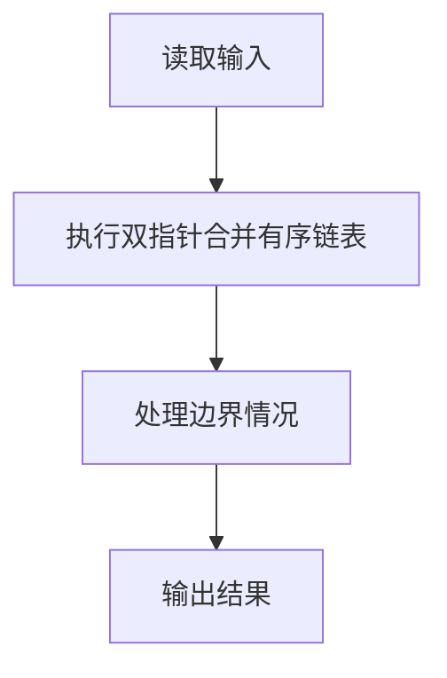
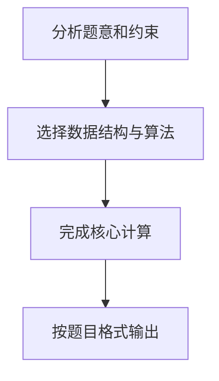

## 7-51 两个有序链表序列的合并

- **分值：** 20分

## 题目描述

已知两个非降序链表序列S1与S2，设计函数构造出S1与S2合并后的新的非降序链表S3。

## 输入格式

输入分两行，分别在每行给出由若干个正整数构成的非降序序列，用-1表示序列的结尾（-1不属于这个序列）。数字用空格间隔。

## 输出格式

在一行中输出合并后新的非降序链表，数字间用空格分开，结尾不能有多余空格；若新链表为空，输出`NULL`。

## 输入样例
```text
1 3 5 -1
2 4 6 8 10 -1
```

## 输出样例
```text
1 2 3 4 5 6 8 10
```

## 解题思路

本题采用双指针合并有序链表，围绕题目给出的数据结构和约束完成核心计算，并处理边界情况。

## 代码流程说明

1. 读取题目规定的输入数据。
2. 使用双指针合并有序链表完成主要处理。
3. 处理边界情况并整理结果。
4. 按指定格式输出结果。

## 代码实现


```perl
# 两个非降序序列用双指针归并，避免重新排序。
use strict;
use warnings;

my $input  = do { local $/; <STDIN> // '' };
my @values = grep { length } split /\s+/, $input;
exit unless @values;
my $pos = 0;

sub read_sequence {
    my @result;
    push @result, $values[ $pos++ ] while $values[$pos] != -1;
    ++$pos;
    return \@result;
}
my ( $first, $second ) = ( read_sequence(), read_sequence() );
my ( $left, $right ) = ( 0, 0 );
my @merged;
while ( $left < @{$first} && $right < @{$second} ) {
    if ( $first->[$left] <= $second->[$right] ) {
        push @merged, $first->[ $left++ ];
    }
    else { push @merged, $second->[ $right++ ] }
}
push @merged, @{$first}[ $left .. $#{$first} ]    if $left < @{$first};
push @merged, @{$second}[ $right .. $#{$second} ] if $right < @{$second};
print @merged ? join( ' ', @merged ) : 'NULL', "\n";
```

## 代码流程图



## 解题流程图


