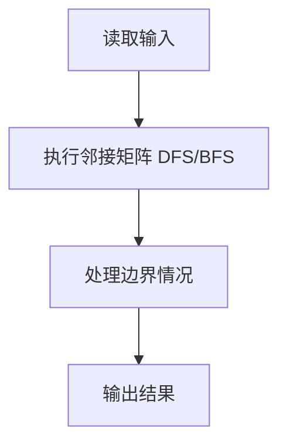
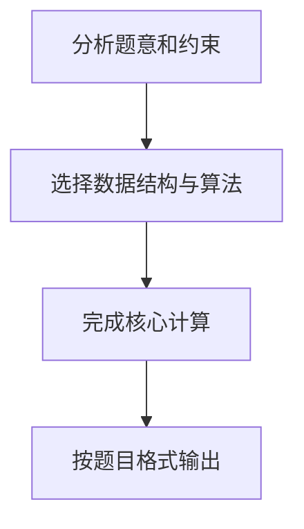

## 7-6 列出连通集

- **分值：** 25分

## 题目描述

给定一个有 n 个顶点和 m 条边的无向图，请用深度优先遍历（DFS）和广度优先遍历（BFS）分别列出其所有的连通集。假设顶点从 0 到 n-1 编号。进行搜索时，假设我们总是从编号最小的顶点出发，按编号递增的顺序访问邻接点。

## 输入格式

输入第 1 行给出 2 个整数 n (0<n\le 10) 和 m，分别是图的顶点数和边数。随后 m 行，每行给出一条边的两个端点。每行中的数字之间用 1 空格分隔。

## 输出格式

按照"{ v_1 v_2 ... v_k }"的格式，每行输出一个连通集。先输出 DFS 的结果，再输出 BFS 的结果。

## 输入样例
```text
8 6
0 7
0 1
2 0
4 1
2 4
3 5
```

## 输出样例
```text
{ 0 1 4 2 7 }
{ 3 5 }
{ 6 }
{ 0 1 2 7 4 }
{ 3 5 }
{ 6 }
```

## 解题思路

本题采用邻接矩阵 DFS/BFS，围绕题目给出的数据结构和约束完成核心计算，并处理边界情况。

## 代码流程说明

1. 读取题目规定的输入数据。
2. 使用邻接矩阵 DFS/BFS完成主要处理。
3. 处理边界情况并整理结果。
4. 按指定格式输出结果。

## 代码实现


```perl
# 邻接表排序后分别 DFS、BFS，确保每个连通集的遍历顺序稳定。
use strict;
use warnings;

my $input = do { local $/; <STDIN> // '' };
my @data  = grep { length } split /\s+/, $input;
exit unless @data;
my ( $n, $m ) = @data[ 0, 1 ];
my @graph = map { [] } 0 .. $n - 1;
my $pos   = 2;
for ( 1 .. $m ) {
    my ( $u, $v ) = @data[ $pos, $pos + 1 ];
    $pos += 2;
    push @{ $graph[$u] }, $v;
    push @{ $graph[$v] }, $u;
}
$_ = [ sort { $a <=> $b } @{$_} ] for @graph;
my @output;

sub dfs {
    my ( $node, $visited, $result ) = @_;
    $visited->[$node] = 1;
    push @{$result}, $node;
    for my $next ( @{ $graph[$node] } ) {
        dfs( $next, $visited, $result ) unless $visited->[$next];
    }
}
my @visited = (0) x $n;
for my $start ( 0 .. $n - 1 ) {
    next if $visited[$start];
    my @result;
    dfs( $start, \@visited, \@result );
    push @output, '{ ' . join( ' ', @result ) . ' }';
}
@visited = (0) x $n;
for my $start ( 0 .. $n - 1 ) {
    next if $visited[$start];
    my @queue = ($start);
    my $head  = 0;
    $visited[$start] = 1;
    my @result;
    while ( $head < @queue ) {
        my $node = $queue[ $head++ ];
        push @result, $node;
        for my $next ( @{ $graph[$node] } ) {
            next if $visited[$next];
            $visited[$next] = 1;
            push @queue, $next;
        }
    }
    push @output, '{ ' . join( ' ', @result ) . ' }';
}
print join( "\n", @output ), "\n";
```

## 代码流程图



## 解题流程图


