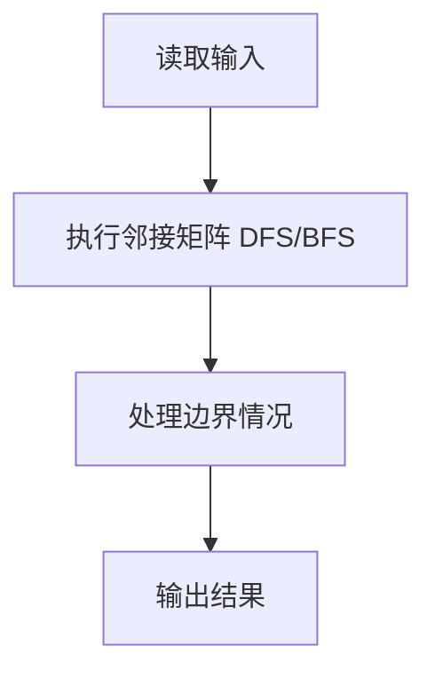
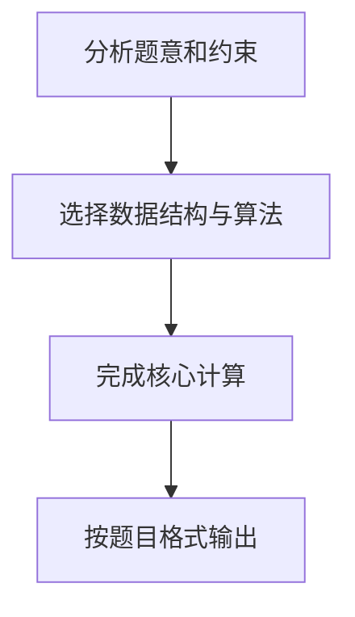

## 7-6 列出连通集

- **分值：** 25分

## 题目描述

给定一个有 n 个顶点和 m 条边的无向图，请用深度优先遍历（DFS）和广度优先遍历（BFS）分别列出其所有的连通集。假设顶点从 0 到 n-1 编号。进行搜索时，假设我们总是从编号最小的顶点出发，按编号递增的顺序访问邻接点。

## 输入格式

输入第 1 行给出 2 个整数 n (0<n\le 10) 和 m，分别是图的顶点数和边数。随后 m 行，每行给出一条边的两个端点。每行中的数字之间用 1 空格分隔。

## 输出格式

按照"{ v_1 v_2 ... v_k }"的格式，每行输出一个连通集。先输出 DFS 的结果，再输出 BFS 的结果。

## 输入样例
```text
8 6
0 7
0 1
2 0
4 1
2 4
3 5
```

## 输出样例
```text
{ 0 1 4 2 7 }
{ 3 5 }
{ 6 }
{ 0 1 2 7 4 }
{ 3 5 }
{ 6 }
```

## 解题思路

本题采用邻接矩阵 DFS/BFS，围绕题目给出的数据结构和约束完成核心计算，并处理边界情况。

## 代码流程说明

1. 读取题目规定的输入数据。
2. 使用邻接矩阵 DFS/BFS完成主要处理。
3. 处理边界情况并整理结果。
4. 按指定格式输出结果。

## 代码实现


```python
"""排序邻接表后分别进行 DFS 和 BFS，保证每个连通集的输出唯一。"""


def main():
    import sys
    from collections import deque
    data = list(map(int, sys.stdin.buffer.read().split()))
    if not data:
        return
    n, m = data[:2]
    graph = [[] for _ in range(n)]
    pos = 2
    for _ in range(m):
        u, v = data[pos:pos + 2]
        pos += 2
        graph[u].append(v)
        graph[v].append(u)
    for neighbors in graph:
        neighbors.sort()

    def dfs(node, visited, result):
        visited[node] = True
        result.append(node)
        for neighbor in graph[node]:
            if not visited[neighbor]:
                dfs(neighbor, visited, result)

    output = []
    visited = [False] * n
    for start in range(n):
        if not visited[start]:
            result = []
            dfs(start, visited, result)
            output.append("{ " + " ".join(map(str, result)) + " }")

    visited = [False] * n
    for start in range(n):
        if visited[start]:
            continue
        queue = deque([start])
        visited[start] = True
        result = []
        while queue:
            node = queue.popleft()
            result.append(node)
            for neighbor in graph[node]:
                if not visited[neighbor]:
                    visited[neighbor] = True
                    queue.append(neighbor)
        output.append("{ " + " ".join(map(str, result)) + " }")
    print("\n".join(output))


if __name__ == "__main__":
    main()
```

## 代码流程图



## 解题流程图


