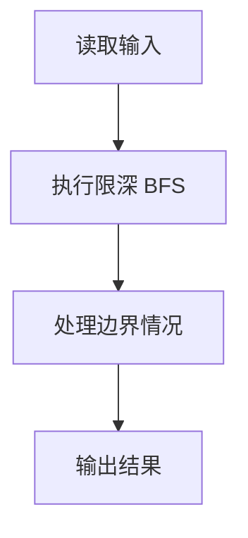
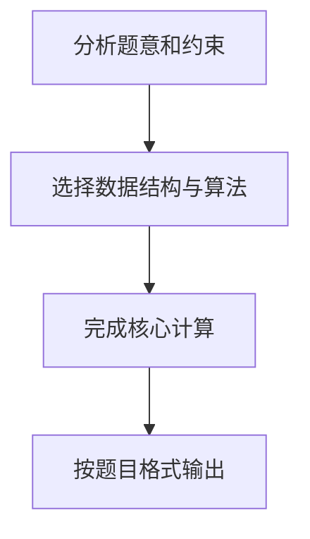

## 7-7 六度空间

- **分值：** 30分

## 题目描述

“六度空间”理论又称作“六度分隔（Six Degrees of Separation）”理论。这个理论可以通俗地阐述为：“你和任何一个陌生人之间所间隔的人不会超过六个，也就是说，最多通过五个人你就能够认识任何一个陌生人。”如图1所示。

<center>
<br>
图1  六度空间示意图</center>

“六度空间”理论虽然得到广泛的认同，并且正在得到越来越多的应用。但是数十年来，试图验证这个理论始终是许多社会学家努力追求的目标。然而由于历史的原因，这样的研究具有太大的局限性和困难。随着当代人的联络主要依赖于电话、短信、微信以及因特网上即时通信等工具，能够体现社交网络关系的一手数据已经逐渐使得“六度空间”理论的验证成为可能。

假如给你一个社交网络图，请你对每个节点计算符合“六度空间”理论的结点占结点总数的百分比。

## 输入格式

输入第1行给出两个正整数，分别表示社交网络图的结点数N（1<N\le 10^3，表示人数）、边数M（\le 33\times N，表示社交关系数）。随后的M行对应M条边，每行给出一对正整数，分别是该条边直接连通的两个结点的编号（节点从1到N编号）。

## 输出格式

对每个结点输出与该结点距离不超过6的结点数占结点总数的百分比，精确到小数点后2位。每个结节点输出一行，格式为“结点编号:（空格）百分比%”。

## 输入样例
```text
10 9
1 2
2 3
3 4
4 5
5 6
6 7
7 8
8 9
9 10
```

## 输出样例
```text
1: 70.00%
2: 80.00%
3: 90.00%
4: 100.00%
5: 100.00%
6: 100.00%
7: 100.00%
8: 90.00%
9: 80.00%
10: 70.00%
```

## 解题思路

本题采用限深 BFS，围绕题目给出的数据结构和约束完成核心计算，并处理边界情况。

## 代码流程说明

1. 读取题目规定的输入数据。
2. 使用限深 BFS完成主要处理。
3. 处理边界情况并整理结果。
4. 按指定格式输出结果。

## 代码实现


```perl
# 对每个顶点做深度上限为 6 的 BFS，统计距离不超过 6 的顶点数。
use strict;
use warnings;

my $input = do { local $/; <STDIN> // '' };
my @data  = grep { length } split /\s+/, $input;
exit unless @data;
my ( $n, $m ) = @data[ 0, 1 ];
my @graph = map { [] } 0 .. $n;
my $pos   = 2;
for ( 1 .. $m ) {
    my ( $u, $v ) = @data[ $pos, $pos + 1 ];
    $pos += 2;
    push @{ $graph[$u] }, $v;
    push @{ $graph[$v] }, $u;
}
my @output;
for my $start ( 1 .. $n ) {
    my @distance = (-1) x ( $n + 1 );
    $distance[$start] = 0;
    my @queue = ($start);
    my $head  = 0;
    my $count = 0;
    while ( $head < @queue ) {
        my $node = $queue[ $head++ ];
        ++$count;
        next if $distance[$node] == 6;
        for my $next ( @{ $graph[$node] } ) {
            next if $distance[$next] != -1;
            $distance[$next] = $distance[$node] + 1;
            push @queue, $next;
        }
    }
    push @output, sprintf( '%d: %.2f%%', $start, 100 * $count / $n );
}
print join( "\n", @output ), "\n";
```

## 代码流程图



## 解题流程图


