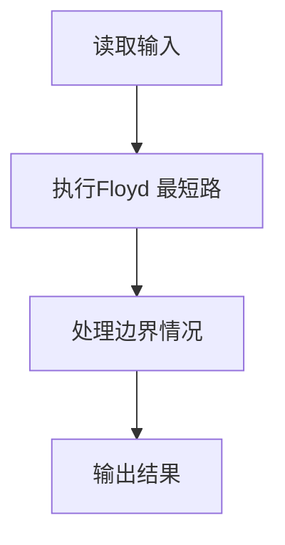
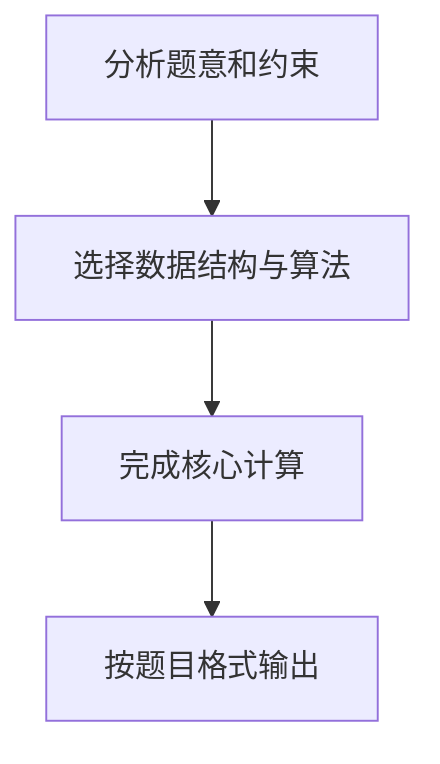

## 7-8 哈利·波特的考试

- **分值：** 25分

## 题目描述

哈利·波特要考试了，他需要你的帮助。这门课学的是用魔咒将一种动物变成另一种动物的本事。例如将猫变成老鼠的魔咒是 haha，将老鼠变成鱼的魔咒是 hehe 等等。反方向变化的魔咒就是简单地将原来的魔咒倒过来念，例如 ahah 可以将老鼠变成猫。另外，如果想把猫变成鱼，可以通过念一个直接魔咒 lalala，也可以将猫变老鼠、老鼠变鱼的魔咒连起来念：hahahehe。

现在哈利·波特的手里有一本教材，里面列出了所有的变形魔咒和能变的动物。老师允许他自己带一只动物去考场，要考察他把这只动物变成任意一只指定动物的本事。于是他来问你：带什么动物去可以让最难变的那种动物（即该动物变为哈利·波特自己带去的动物所需要的魔咒最长）需要的魔咒最短？例如：如果只有猫、鼠、鱼，则显然哈利·波特应该带鼠去，因为鼠变成另外两种动物都只需要念 4 个字符；而如果带猫去，则至少需要念 6 个字符才能把猫变成鱼；同理，带鱼去也不是最好的选择。

## 输入格式

输入说明：输入第 1 行给出两个正整数 n (\le 100)和 m，其中 n 是考试涉及的动物总数，m 是用于直接变形的魔咒条数。为简单起见，我们将动物按 1 ~ n 编号。随后 m 行，每行给出了 3 个正整数，分别是两种动物的编号、以及它们之间变形需要的魔咒的长度(\le 100)，数字之间用空格分隔。

## 输出格式

输出哈利·波特应该带去考场的动物的编号、以及最长的变形魔咒的长度，中间以空格分隔。如果只带1只动物是不可能完成所有变形要求的，则输出 0。如果有若干只动物都可以备选，则输出编号最小的那只。

## 输入样例
```text
6 11
3 4 70
1 2 1
5 4 50
2 6 50
5 6 60
1 3 70
4 6 60
3 6 80
5 1 100
2 4 60
5 2 80
```

## 输出样例
```text
4 70
```

## 解题思路

本题采用Floyd 最短路，围绕题目给出的数据结构和约束完成核心计算，并处理边界情况。

## 代码流程说明

1. 读取题目规定的输入数据。
2. 使用Floyd 最短路完成主要处理。
3. 处理边界情况并整理结果。
4. 按指定格式输出结果。

## 代码实现


```perl
# Floyd-Warshall 求全源最短路，再选择离其它动物最远距离最小者。
use strict;
use warnings;

my $input = do { local $/; <STDIN> // '' };
my @data  = grep { length } split /\s+/, $input;
exit unless @data;
my ( $n, $m ) = @data[ 0, 1 ];
my $inf      = 10**18;
my @distance = map { [ ($inf) x $n ] } 1 .. $n;
$distance[$_][$_] = 0 for 0 .. $n - 1;
my $pos = 2;

for ( 1 .. $m ) {
    my ( $u, $v, $w ) = @data[ $pos .. $pos + 2 ];
    $pos += 3;
    --$u;
    --$v;
    $distance[$u][$v] = $w if $w < $distance[$u][$v];
    $distance[$v][$u] = $w if $w < $distance[$v][$u];
}
for my $middle ( 0 .. $n - 1 ) {
    for my $start ( 0 .. $n - 1 ) {
        for my $end ( 0 .. $n - 1 ) {
            my $candidate =
              $distance[$start][$middle] + $distance[$middle][$end];
            $distance[$start][$end] = $candidate
              if $candidate < $distance[$start][$end];
        }
    }
}
my ( $best_node, $best_distance ) = ( 0, $inf );
for my $i ( 0 .. $n - 1 ) {
    my $maximum = 0;
    for my $j ( 0 .. $n - 1 ) {
        $maximum = $distance[$i][$j] if $distance[$i][$j] > $maximum;
    }
    next if $maximum >= $inf;
    if ( $maximum < $best_distance ) {
        ( $best_node, $best_distance ) = ( $i + 1, $maximum );
    }
}
print $best_node ? "$best_node $best_distance\n" : "0\n";
```

## 代码流程图



## 解题流程图


