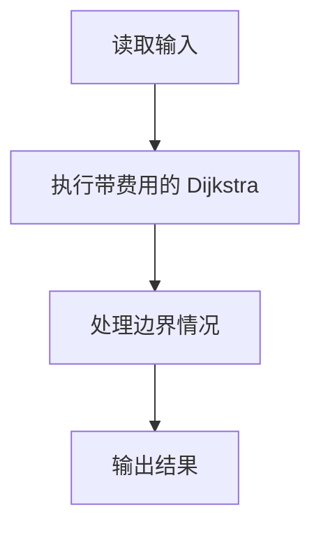
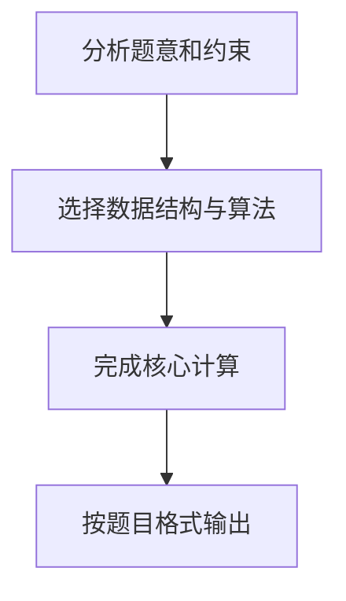

## 7-9 旅游规划

- **分值：** 25分

## 题目描述

有了一张自驾旅游路线图，你会知道城市间的高速公路长度、以及该公路要收取的过路费。现在需要你写一个程序，帮助前来咨询的游客找一条出发地和目的地之间的最短路径。如果有若干条路径都是最短的，那么需要输出最便宜的一条路径。

## 输入格式

输入说明：输入数据的第 1 行给出 4 个正整数 n、m、s、d，其中 n（2\le n\le 500）是城市的个数，顺便假设城市的编号为 0~(n-1)；m 是高速公路的条数；s 是出发地的城市编号；d 是目的地的城市编号。随后的 m 行中，每行给出一条高速公路的信息，分别是：城市 1、城市 2、高速公路长度、收费额，中间用空格分开，数字均为整数且不超过 500。输入保证解的存在。

## 输出格式

在一行里输出路径的长度和收费总额，数字间以空格分隔，输出结尾不能有多余空格。

## 输入样例
```text
4 5 0 3
0 1 1 20
1 3 2 30
0 3 4 10
0 2 2 20
2 3 1 20
```

## 输出样例
```text
3 40
```

## 解题思路

本题采用带费用的 Dijkstra，围绕题目给出的数据结构和约束完成核心计算，并处理边界情况。

## 代码流程说明

1. 读取题目规定的输入数据。
2. 使用带费用的 Dijkstra完成主要处理。
3. 处理边界情况并整理结果。
4. 按指定格式输出结果。

## 代码实现


```python
"""Dijkstra 的比较键为（路径长度、收费），实现双关键字最短路。"""


def main():
    import sys
    data = list(map(int, sys.stdin.buffer.read().split()))
    if not data:
        return
    n, m, source, target = data[:4]
    infinity = 10 ** 18
    graph = [[] for _ in range(n)]
    pos = 4
    for _ in range(m):
        u, v, length, cost = data[pos:pos + 4]
        pos += 4
        graph[u].append((v, length, cost))
        graph[v].append((u, length, cost))

    distance = [infinity] * n
    fee = [infinity] * n
    used = [False] * n
    distance[source] = fee[source] = 0
    for _ in range(n):
        current = min(
            (i for i in range(n) if not used[i]),
            key=lambda i: distance[i],
            default=-1,
        )
        if current == -1 or distance[current] == infinity:
            break
        used[current] = True
        for neighbor, length, cost in graph[current]:
            candidate = (distance[current] + length, fee[current] + cost)
            if candidate < (distance[neighbor], fee[neighbor]):
                distance[neighbor], fee[neighbor] = candidate
    print(distance[target], fee[target])


if __name__ == "__main__":
    main()
```

## 代码流程图



## 解题流程图


